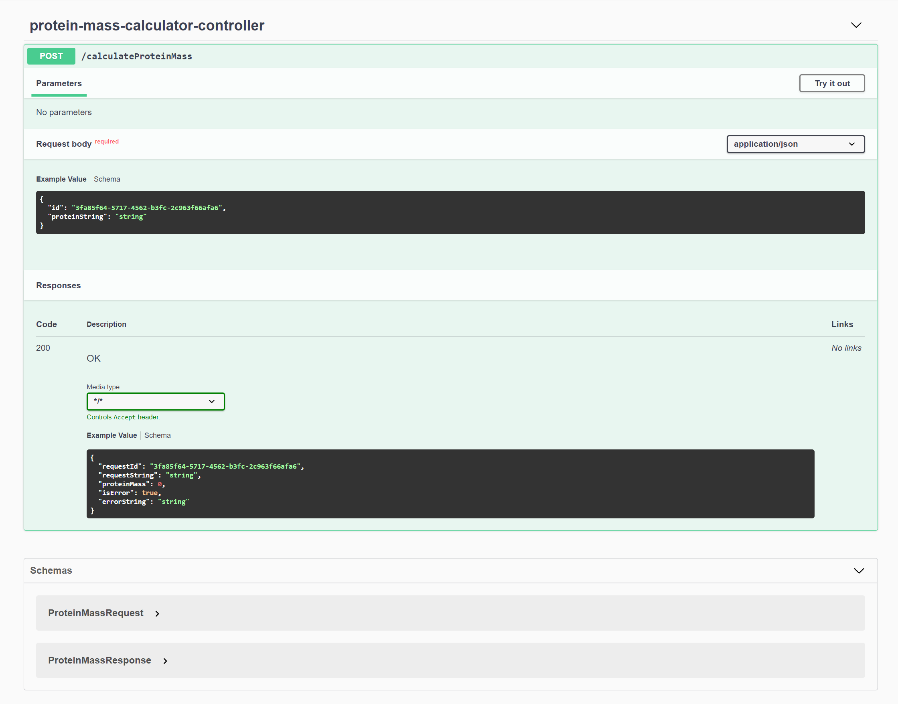
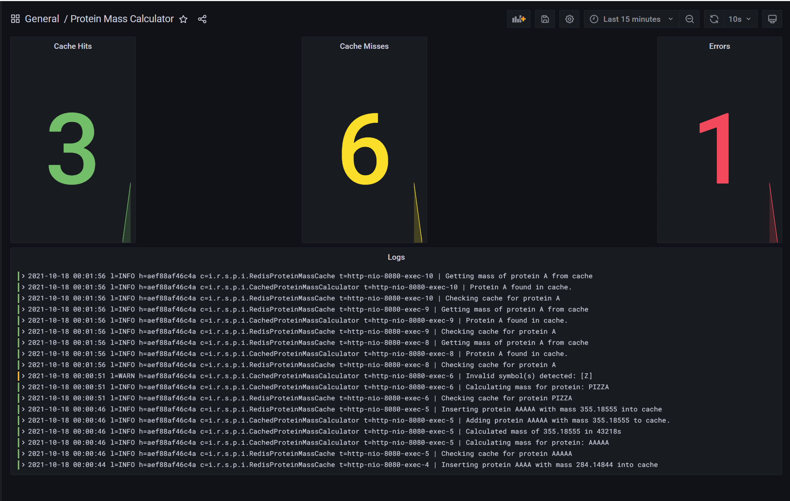

# Protein Mass Calcuator
A sample service implemented in Spring Boot which calculates the mass of a given protein string. This project is based on this [Rosalind Problem](http://rosalind.info/problems/prtm/).

The service accepts protein strings comprised of amino acid symbols found in this [table](http://rosalind.info/glossary/monoisotopic-mass-table/). Valid requests will received the calculated mass as a result while invalid requests will receive an message describing the error.

## Getting Started

### Prerequisites
This project is configured to run completely in Docker containers and requires no installed prerequisites beyond `docker` and `docker-compose`. It has be validated on both Ubuntu Linux and Windows Subsystem for Linux (WSL). It should also be supported on Apple OSX.

### Do Scripts
The `.do` directory contains a number of scripts which perform common development actions.

| Script | Function | Accepts Parameters |
|--------|----------|--------------------|
| `.do/setup` | Builds development and dependency Docker images and starts `docker-compose` services. | No |
| `.do/setup` | Stops development and dependency services | No |
| `.do/dev` | Runs commands inside development container. | Yes. Commands will be passed into container bash shell |
| `.do/test` | Runs `./mvnw test` inside development container. | No |
| `.do/build` | Runs `./mvnw compile` inside development container. | No |
| `.do/run` | Runs `./mvnw spring-boot:run` inside development container. Application will be available at http://localhost:8080 | No |


## Running the Application
To quickly start up the application, run:

```bash
.do/setup
.do/run
```

After these scripts complete the application will be available at http://localhost:8080

### Swagger UI
This application hosts a Swagger based UI to faciliate easy testing of the API. To view this page, visit [this url](http://localhost:8080/swagger-ui/index.html?configUrl=/v3/api-docs/swagger-config).




### Telemetry Dashboard
This application is generating both logs and metrics which are being aggregated and displayed on a Grafana based dashboard. This dashboard is available [here](http://localhost:3000/d/KJDtGFdnk/protein-mass-calculator). If prompted, the intial username/password are `admin`/`admin`.




## Development
To setup a dvelopment environment, run:
```
.do/setup
```

This will launch all the dependency containers as well as a development container with the project source directory mounted as a volume. 

To execute commands inside the development container, run:

```bash
.do/dev <COMMAND>
```

There are additional scripts for performing common actions such as:

```bash
.do/build # Compiles the project
.do/test # Runs test suite
```

### Project Structure
The main source for the project is under the directory `src/main/java/io/refi/samples/proteinmasscalculator` and contains the following items:

| Item | Description |
| -----|-------------|
| `impl` | Directory containing service implementations |
| `interfaces` | Directory containing service interface definitions |
| `models` | Directory containing data model definitions |
| `ProteinMassCalculatorApplication.java` | Main application class for the project |
| `ProteinMassCalculatorConfig.java` | Main configuration class for application |
| `ProteinMassCalculatorController.java` | REST controller that exposes calculator service as an endpoint |

The `interfaces` directory contains the following items:

| Item | Description |
| -----| ------------|
| `MonoistopicMassTable.java` | Interface which defines a repository which provides mass figures for amino acids. |
| `ProteinMassCache.java` | Interface which defines a repository to store and retrieve mass figures for protein strings |
| `ProteinMassCalculator.java` | Interface which defines a service which calculates the mass of a particular protein string. | 


The `impl` directory contains the following items:

| Item | Description |
| -----| ------------|
| `BaseProteinMassCalculator.java` | Base implementation of the `ProteinMassCalculator` interface |
| `CachedProteinMassCalculator.java` | Extension of the `BaseProteinMassCalculator` with a cache to prevent repeated calculations. |
| `InMemoryProteinMassCache.java` | Implmentation of the `ProteinMassCache` interface storing values in memory | 
| `RedisProteinMassCache.java` | Implementation of the `ProteinMassCache` interface which stores values in a Redis data store |
| `StaticMonositopicMassTable.java` | Implementation of the `MonoistopicMassTable` interface with statically defined values |

The `models` directory contains the following items:
| Item | Description |
| -----| ------------|
| `ProteinMassRequest.java` | Model used to request a protein mass calculation |
| `ProteinMassResponse.java` | Model returned as the result of a protein mass calculation |

Full API documentation is available at https://jrefi.github.io/protein-mass-calculator
